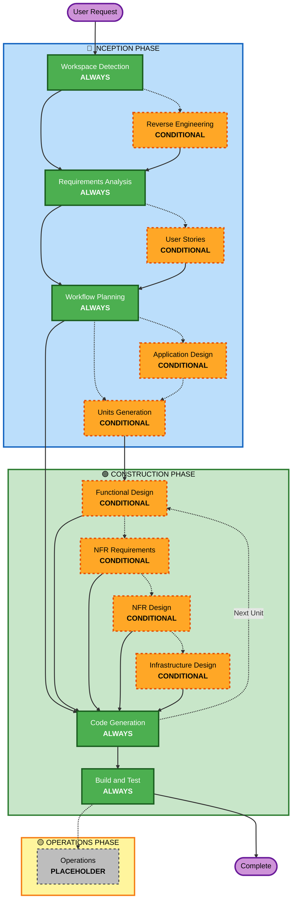

# AI-DLC 適応型ワークフロー概要

**目的**: AI モデルと開発者が全体のワークフロー構造を理解するための技術リファレンス。

**注記**: 同様の内容が core-workflow.md（ユーザー向けウェルカムメッセージ）と README.md（ドキュメント）にも存在します。この重複は**意図的**です。各ファイルの目的は異なります:

- **本ファイル**: AI モデルのコンテキスト読み込み向け、Mermaid 図付きの詳細技術リファレンス
- **core-workflow.md**: ASCII 図付きのユーザー向けウェルカムメッセージ
- **README.md**: リポジトリ向けの人間可読ドキュメント

## 3 フェーズのライフサイクル:

• **INCEPTION フェーズ**: 計画とアーキテクチャ（Workspace Detection + 条件付きフェーズ + Workflow Planning）
• **CONSTRUCTION フェーズ**: 設計、実装、ビルドとテスト（ユニットごとの設計 + Code Planning/Generation + Build & Test）
• **OPERATIONS フェーズ**: 将来のデプロイと監視ワークフローのためのプレースホルダー

## 適応型ワークフロー:

• **Workspace Detection**（常に実行）→ **Reverse Engineering**（ブラウンフィールドのみ）→ **Requirements Analysis**（常に実行・深さは適応）→ **Conditional Phases**（必要に応じて）→ **Workflow Planning**（常に実行）→ **Code Generation**（常に実行・ユニットごと）→ **Build and Test**（常に実行）

## 仕組み:

• **AI が分析**: 要求、ワークスペース、複雑さに基づいて必要なステージを決定
• **常に実行されるステージ**: Workspace Detection、Requirements Analysis（適応深度）、Workflow Planning、Code Generation（ユニットごと）、Build and Test
• **その他は条件付き**: Reverse Engineering、User Stories、Application Design、Units Generation、ユニットごとの設計ステージ（Functional Design、NFR Requirements、NFR Design、Infrastructure Design）
• **固定順序はない**: 具体的なタスクに適した順序で実行

## チームの役割:

• **専用の質問ファイルに回答**: [Answer]: タグと文字選択肢（A, B, C, D, E）を使用
• **選択肢 E あり**: 既定の選択肢に当てはまらない場合は "Other" を選び、自由に記述
• **チームでレビューと承認**: 各フェーズを進める前に確認・承認
• **必要に応じてアーキテクチャ方針を共同決定**
• **重要**: チーム作業として、各フェーズで関係者を巻き込む

## AI-DLC 3 フェーズワークフロー:

**ステージ説明:**

**🔵 INCEPTION フェーズ** - 計画とアーキテクチャ

- Workspace Detection: ワークスペース状態とプロジェクト種別を分析（常に実行）
- Reverse Engineering: 既存コードベースを分析（条件付き - ブラウンフィールドのみ）
- Requirements Analysis: 要件を収集・検証（常に実行 - 深さは適応）
- User Stories: ユーザーストーリーとペルソナを作成（条件付き）
- Workflow Planning: 実行計画を作成（常に実行）
- Application Design: 高レベルのコンポーネント識別とサービス層設計（条件付き）
- Units Generation: 作業単位へ分解（条件付き）

**🟢 CONSTRUCTION フェーズ** - 設計、実装、ビルドとテスト

- Functional Design: ユニットごとの詳細なビジネスロジック設計（条件付き、ユニットごと）
- NFR Requirements: NFR を決定し技術スタックを選定（条件付き、ユニットごと）
- NFR Design: NFR パターンと論理コンポーネントを取り込み（条件付き、ユニットごと）
- Infrastructure Design: 実際のインフラサービスにマッピング（条件付き、ユニットごと）
- Code Generation: Part 1 - 計画、Part 2 - 生成でコード生成（常に実行、ユニットごと）
- Build and Test: すべてのユニットをビルドし包括的にテスト（常に実行）

**🟡 OPERATIONS フェーズ** - プレースホルダー

- Operations: 将来のデプロイと監視ワークフローのためのプレースホルダー（PLACEHOLDER）

**主要原則:**

- フェーズは価値がある場合にのみ実行
- 各フェーズは独立に評価
- INCEPTION は "what" と "why" に集中
- CONSTRUCTION は "how" と "build and test" に集中
- OPERATIONS は将来拡張用のプレースホルダー
- 単純な変更は条件付きの INCEPTION ステージをスキップする場合がある
- 複雑な変更は INCEPTION と CONSTRUCTION の全体的な対応が必要
