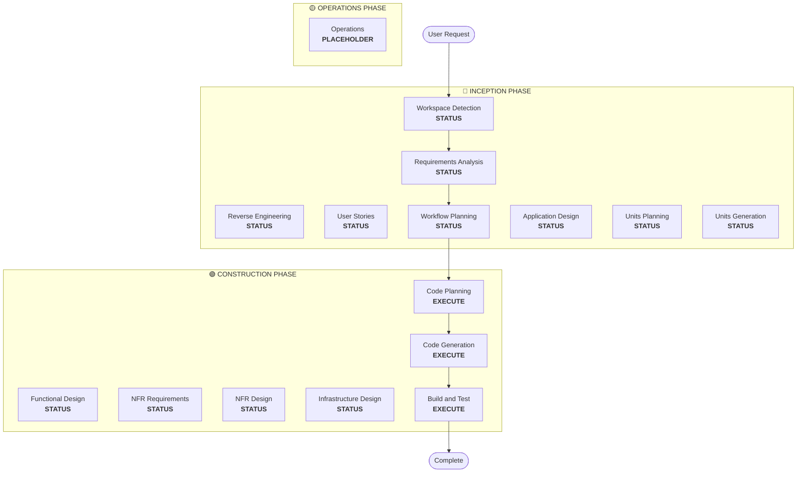

# Workflow Planning

**目的**: 実行するフェーズを決定し、包括的な実行計画を作成する

**常に実行**: 要件とスコープを理解した後に必ず実行するフェーズ

## ステップ 1: これまでのコンテキストをすべて読み込む

### 1.1 リバースエンジニアリング成果物の読み込み（ブラウンフィールドの場合）
- architecture.md
- component-inventory.md
- technology-stack.md
- dependencies.md

### 1.2 Requirements Analysis の読み込み
- requirements.md（意図分析を含む）
- requirement-verification-questions.md（回答付き）

### 1.3 User Stories の読み込み（実施した場合）
- stories.md
- personas.md

## ステップ 2: 詳細なスコープ/影響分析

**完全なコンテキスト（要件 + ストーリー）がある前提で詳細分析を行う:**

### 2.1 変換スコープの検出（ブラウンフィールドのみ）

**ブラウンフィールドの場合**、変換スコープを分析:

#### アーキテクチャ変換
- **単一コンポーネント変更** vs **アーキテクチャ変換**
- **インフラ変更** vs **アプリケーション変更**
- **デプロイモデル変更**（Lambda→Container、EC2→Serverless など）

#### 関連コンポーネントの特定
変換の場合、次を特定:
- **更新が必要なインフラコード**
- **変更が必要な CDK スタック**
- **API Gateway 設定**
- **ロードバランサ要件**
- **ネットワーク変更**
- **監視/ログの調整**

#### パッケージ横断の影響
- **CDK インフラ**パッケージの更新
- **共有モデル**のバージョン更新
- **クライアントライブラリ**のエンドポイント変更
- **テストパッケージ**の新しいテストシナリオ

### 2.2 変更影響評価

#### 影響領域
1. **ユーザー向け変更**: 体験に影響するか
2. **構造変更**: システムアーキテクチャに影響するか
3. **データモデル変更**: DB スキーマや構造に影響するか
4. **API 変更**: インターフェイス/契約に影響するか
5. **NFR 影響**: 性能、セキュリティ、スケーラビリティに影響するか

#### アプリケーション層の影響（該当時）
- **コード変更**: 新しいエントリポイント、アダプタ、設定
- **依存関係**: 新しいライブラリ、フレームワーク変更
- **設定**: 環境変数、設定ファイル
- **テスト**: 単体/統合テスト

#### インフラ層の影響（該当時）
- **デプロイモデル**: Lambda→ECS、EC2→Fargate など
- **ネットワーク**: VPC、セキュリティグループ、LB
- **ストレージ**: 永続ボリューム、共有ストレージ
- **スケーリング**: オートスケール方針、容量計画

#### 運用層の影響（該当時）
- **監視**: CloudWatch、カスタムメトリクス、ダッシュボード
- **ログ**: 集約、構造化ログ
- **アラート**: アラーム設定、通知チャネル
- **デプロイ**: CI/CD パイプライン変更、ロールバック戦略

### 2.3 コンポーネント関係マッピング（ブラウンフィールドのみ）

**ブラウンフィールドの場合**、コンポーネント依存グラフを作成:

```markdown
## Component Relationships
- **Primary Component**: [Package being changed]
- **Infrastructure Components**: [CDK/Terraform packages]
- **Shared Components**: [Models, utilities, clients]
- **Dependent Components**: [Services that call this component]
- **Supporting Components**: [Monitoring, logging, deployment]
```

各関連コンポーネントについて:
- **変更タイプ**: Major, Minor, Configuration-only
- **変更理由**: 直接依存、デプロイモデル、ネットワーク
- **変更優先度**: Critical, Important, Optional

### 2.4 リスク評価

リスクレベルを評価:
1. **低**: 影響が限定、ロールバック容易、理解済み
2. **中**: 複数コンポーネント、ロールバック中程度、不確実性あり
3. **高**: システム全体への影響、ロールバック困難、不確実性大
4. **重大**: 重要本番系、ロールバック困難、高い不確実性

## ステップ 3: フェーズ決定

### 3.1 User Stories - 既に実行済みかスキップか
**実行済み**: 次の判断へ
**未実行 - 実行条件**:
- 複数のユーザーペルソナ
- ユーザー体験への影響
- 受け入れ基準が必要
- チーム協業が必要

**スキップ条件**:
- 内部リファクタ
- 再現が明確なバグ修正
- 技術的負債削減
- インフラ変更

### 3.2 Application Design - 実行条件
- 新しいコンポーネント/サービスが必要
- コンポーネントメソッドやビジネスルールの定義が必要
- サービス層設計が必要
- コンポーネント依存が不明確

**スキップ条件**:
- 既存コンポーネント境界内の変更
- 新しいコンポーネント/メソッドが不要
- 純粋な実装変更

### 3.3 Design（Units Planning/Generation）- 実行条件
- 新しいデータモデル/スキーマ
- API 変更または新規エンドポイント
- 複雑なアルゴリズム/ビジネスロジック
- 状態管理の変更
- 複数パッケージに変更が必要
- Infrastructure-as-code の更新が必要

**スキップ条件**:
- 単純なロジック変更
- UI のみの変更
- 設定更新
- 直線的な実装

### 3.4 NFR 実装 - 実行条件
- 性能要件
- セキュリティ考慮
- スケーラビリティ懸念
- 監視/可観測性が必要

**スキップ条件**:
- 既存 NFR セットアップで十分
- 新しい NFR 要件がない
- NFR 影響のない単純変更

## ステップ 4: 適応的詳細度の注記

**適応的詳細度の説明は [depth-levels.md](../common/depth-levels.md) を参照**

実行する各ステージについて:
- 定義済み成果物はすべて作成される
- 成果物内の詳細度は問題の複雑さに応じて調整
- モデルが問題特性に基づいて適切な詳細度を判断

## ステップ 5: マルチモジュール調整分析（ブラウンフィールドのみ）

**複数モジュール/パッケージのブラウンフィールドの場合**、依存関係を分析し最適な更新戦略を決定:

### 5.1 モジュール依存の分析
- ビルド依存と依存マニフェストを確認
- ビルド時依存 vs 実行時依存を識別
- モジュール間の API 契約と共有インターフェイスをマッピング

### 5.2 更新戦略の決定
依存分析に基づいて決定:
- **更新順序**: 依存関係で先に更新すべきモジュール
- **並列化**: 同時に更新可能なモジュール
- **調整要件**: バージョン互換、API 契約、デプロイ順
- **テスト戦略**: モジュール単体 vs 統合テスト
- **ロールバック戦略**: 途中失敗時の復旧計画

### 5.3 調整計画の文書化
```markdown
## Module Update Strategy
- **Update Approach**: [Sequential/Parallel/Hybrid]
- **Critical Path**: [Modules that block other updates]
- **Coordination Points**: [Shared APIs, infrastructure, data contracts]
- **Testing Checkpoints**: [When to validate integration]
```

影響する各モジュールについて:
- **更新優先度**: 先行必須 vs 後回し可
- **依存制約**: 依存先/依存元
- **変更スコープ**: Major（破壊的）、Minor（互換）、Patch（修正）

## ステップ 6: ワークフロー可視化の生成

Mermaid フローチャートを作成:
- すべてのフェーズを順に表示
- 各条件付きフェーズの EXECUTE/SKIP を明示
- フェーズ状態に適したスタイルを適用

**スタイル規則**（フローチャートの後に追加）:
```
style WD fill:#4CAF50,stroke:#1B5E20,stroke-width:3px,color:#fff
style CP fill:#4CAF50,stroke:#1B5E20,stroke-width:3px,color:#fff
style CG fill:#4CAF50,stroke:#1B5E20,stroke-width:3px,color:#fff
style BT fill:#4CAF50,stroke:#1B5E20,stroke-width:3px,color:#fff
style US fill:#BDBDBD,stroke:#424242,stroke-width:2px,stroke-dasharray: 5 5,color:#000
style Start fill:#CE93D8,stroke:#6A1B9A,stroke-width:3px,color:#000
style End fill:#CE93D8,stroke:#6A1B9A,stroke-width:3px,color:#000

linkStyle default stroke:#333,stroke-width:2px
```

**スタイル指針**:
- 完了/常に実行: `fill:#4CAF50,stroke:#1B5E20,stroke-width:3px,color:#fff`
- 条件付き EXECUTE: `fill:#FFA726,stroke:#E65100,stroke-width:3px,stroke-dasharray: 5 5,color:#000`
- 条件付き SKIP: `fill:#BDBDBD,stroke:#424242,stroke-width:2px,stroke-dasharray: 5 5,color:#000`
- Start/End: `fill:#CE93D8,stroke:#6A1B9A,stroke-width:3px,color:#000`
- フェーズ枠: 薄い Material 色（INCEPTION: #BBDEFB, CONSTRUCTION: #C8E6C9, OPERATIONS: #FFF59D）

## ステップ 7: 実行計画ドキュメントの作成

`aidlc-docs/inception/plans/execution-plan.md` を作成:

```markdown
# Execution Plan

## Detailed Analysis Summary

### Transformation Scope (Brownfield Only)
- **Transformation Type**: [Single component/Architectural/Infrastructure]
- **Primary Changes**: [Description]
- **Related Components**: [List]

### Change Impact Assessment
- **User-facing changes**: [Yes/No - Description]
- **Structural changes**: [Yes/No - Description]
- **Data model changes**: [Yes/No - Description]
- **API changes**: [Yes/No - Description]
- **NFR impact**: [Yes/No - Description]

### Component Relationships (Brownfield Only)
[Component dependency graph]

### Risk Assessment
- **Risk Level**: [Low/Medium/High/Critical]
- **Rollback Complexity**: [Easy/Moderate/Difficult]
- **Testing Complexity**: [Simple/Moderate/Complex]

## Workflow Visualization



**注記**: STATUS を実際の状態（COMPLETED/SKIP/EXECUTE）に置換し、適切なスタイルを適用

## Phases to Execute

### 🔵 INCEPTION PHASE
- [x] Workspace Detection (COMPLETED)
- [x] Reverse Engineering (COMPLETED/SKIPPED)
- [x] Requirements Elaboration (COMPLETED)
- [x] User Stories (COMPLETED/SKIPPED)
- [x] Execution Plan (IN PROGRESS)
- [ ] Application Design - [EXECUTE/SKIP]
  - **Rationale**: [Why executing or skipping]
- [ ] Units Planning - [EXECUTE/SKIP]
  - **Rationale**: [Why executing or skipping]
- [ ] Units Generation - [EXECUTE/SKIP]
  - **Rationale**: [Why executing or skipping]

### 🟢 CONSTRUCTION PHASE
- [ ] Functional Design - [EXECUTE/SKIP]
  - **Rationale**: [Why executing or skipping]
- [ ] NFR Requirements - [EXECUTE/SKIP]
  - **Rationale**: [Why executing or skipping]
- [ ] NFR Design - [EXECUTE/SKIP]
  - **Rationale**: [Why executing or skipping]
- [ ] Infrastructure Design - [EXECUTE/SKIP]
  - **Rationale**: [Why executing or skipping]
- [ ] Code Planning - EXECUTE (ALWAYS)
  - **Rationale**: Implementation approach needed
- [ ] Code Generation - EXECUTE (ALWAYS)
  - **Rationale**: Code implementation needed
- [ ] Build and Test - EXECUTE (ALWAYS)
  - **Rationale**: Build, test, and verification needed

### 🟡 OPERATIONS PHASE
- [ ] Operations - PLACEHOLDER
  - **Rationale**: Future deployment and monitoring workflows

## Package Change Sequence (Brownfield Only)
[If applicable, list package update sequence with dependencies]

## Estimated Timeline
- **Total Phases**: [Number]
- **Estimated Duration**: [Time estimate]

## Success Criteria
- **Primary Goal**: [Main objective]
- **Key Deliverables**: [List]
- **Quality Gates**: [List]

[IF brownfield]
- **Integration Testing**: All components working together
- **Operational Readiness**: Monitoring, logging, alerting working
```

## ステップ 8: 状態追跡の初期化

`aidlc-docs/aidlc-state.md` を更新:

```markdown
# AI-DLC State Tracking

## Project Information
- **Project Type**: [Greenfield/Brownfield]
- **Start Date**: [ISO timestamp]
- **Current Stage**: INCEPTION - Workflow Planning

## Execution Plan Summary
- **Total Stages**: [Number]
- **Stages to Execute**: [List]
- **Stages to Skip**: [List with reasons]

## Stage Progress

### 🔵 INCEPTION PHASE
- [x] Workspace Detection
- [x] Reverse Engineering (if applicable)
- [x] Requirements Analysis
- [x] User Stories (if applicable)
- [x] Workflow Planning
- [ ] Application Design - [EXECUTE/SKIP]
- [ ] Units Planning - [EXECUTE/SKIP]
- [ ] Units Generation - [EXECUTE/SKIP]

### 🟢 CONSTRUCTION PHASE
- [ ] Functional Design - [EXECUTE/SKIP]
- [ ] NFR Requirements - [EXECUTE/SKIP]
- [ ] NFR Design - [EXECUTE/SKIP]
- [ ] Infrastructure Design - [EXECUTE/SKIP]
- [ ] Code Planning - EXECUTE
- [ ] Code Generation - EXECUTE
- [ ] Build and Test - EXECUTE

### 🟡 OPERATIONS PHASE
- [ ] Operations - PLACEHOLDER

## Current Status
- **Lifecycle Phase**: INCEPTION
- **Current Stage**: Workflow Planning Complete
- **Next Stage**: [Next stage to execute]
- **Status**: Ready to proceed
```

## ステップ 9: 計画をユーザーに提示

```markdown
# 📋 Workflow Planning Complete

I've created a comprehensive execution plan based on:
- Your request: [Summary]
- Existing system: [Summary if brownfield]
- Requirements: [Summary if executed]
- User stories: [Summary if executed]

**Detailed Analysis**:
- Risk level: [Level]
- Impact: [Summary of key impacts]
- Components affected: [List]

**Recommended Execution Plan**:

I recommend executing [X] stages:

🔵 **INCEPTION PHASE:**
1. [Stage name] - *Rationale:* [Why executing]
2. [Stage name] - *Rationale:* [Why executing]
...

🟢 **CONSTRUCTION PHASE:**
3. [Stage name] - *Rationale:* [Why executing]
4. [Stage name] - *Rationale:* [Why executing]
...

I recommend skipping [Y] stages:

🔵 **INCEPTION PHASE:**
1. [Stage name] - *Rationale:* [Why skipping]
2. [Stage name] - *Rationale:* [Why skipping]
...

🟢 **CONSTRUCTION PHASE:**
3. [Stage name] - *Rationale:* [Why skipping]
4. [Stage name] - *Rationale:* [Why skipping]
...

[IF brownfield with multiple packages]
**Recommended Package Update Sequence**:
1. [Package] - [Reason]
2. [Package] - [Reason]
...

**Estimated Timeline**: [Duration]

> **📋 <u>**REVIEW REQUIRED:**</u>**  
> Please examine the execution plan at: `aidlc-docs/inception/plans/execution-plan.md`

> **🚀 <u>**WHAT'S NEXT?**</u>**
>
> **You may:**
>
> 🔧 **Request Changes** - Ask for modifications to the execution plan if required
> [IF any stages are skipped:]
> 📝 **Add Skipped Stages** - Choose to include stages currently marked as SKIP
> ✅ **Approve & Continue** - Approve plan and proceed to **[Next Stage Name]**
```

## ステップ 10: ユーザー応答の処理

- **承認された場合**: 次ステージへ進む
- **変更依頼**: 実行計画を更新して再確認
- **ユーザーがステージの強制含め/除外を希望**: 計画を更新

## ステップ 11: 取り扱いの記録

`aidlc-docs/audit.md` に記録:

```markdown
## Workflow Planning - Approval
**Timestamp**: [ISO timestamp]
**AI Prompt**: "Ready to proceed with this plan?"
**User Response**: "[User's COMPLETE RAW response]"
**Status**: [Approved/Changes Requested]
**Context**: Workflow plan created with [X] stages to execute

---
```
